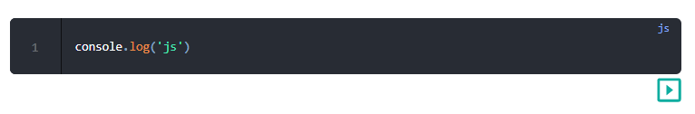
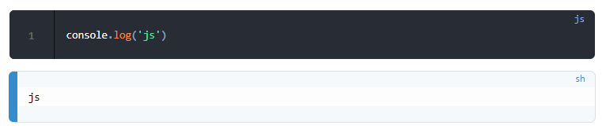
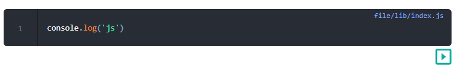
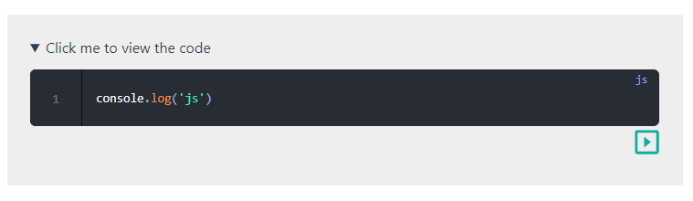

# vuepress-plugin-run-codeblock

## Introduction
show and run codeblock in vuepress

## Support
vuepress 1.x

## Install
`npm i vuepress-plugin-run-codeblock`

## Usage

### step 1
in `[..your vuepress project..]/docs/.vuepress/config.js`

set:
```js
...
plugins: [
  [require('vuepress-plugin-run-codeblock')],
],
...
```

### step 2

#### use in markdowm 

- base

````md
::: run
```js
console.log('js')
```
:::
````




you can click the button to run the code



- show file name
````md
::: run file/lib/index.js
```js
console.log('js')
```
:::
````



- use in another container
````md
:::: details Click me to view the code
::: run
```js
console.log('js')
```
:::
::::
````



see: [markdown-it-container/issues](https://github.com/markdown-it/markdown-it-container/issues/33#issuecomment-551111227)

## About 
the api is supported by [https://wandbox.org/](https://wandbox.org/)


<!-- todo:
1. 智能识别语言别名
2. 运行结果显示语言改为js,右上角content改成编译器提示信息
-->
